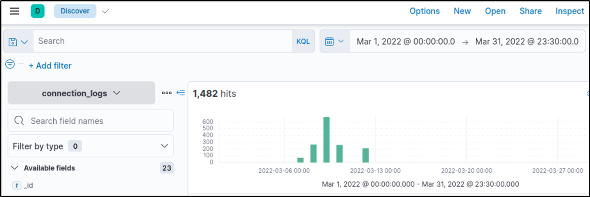
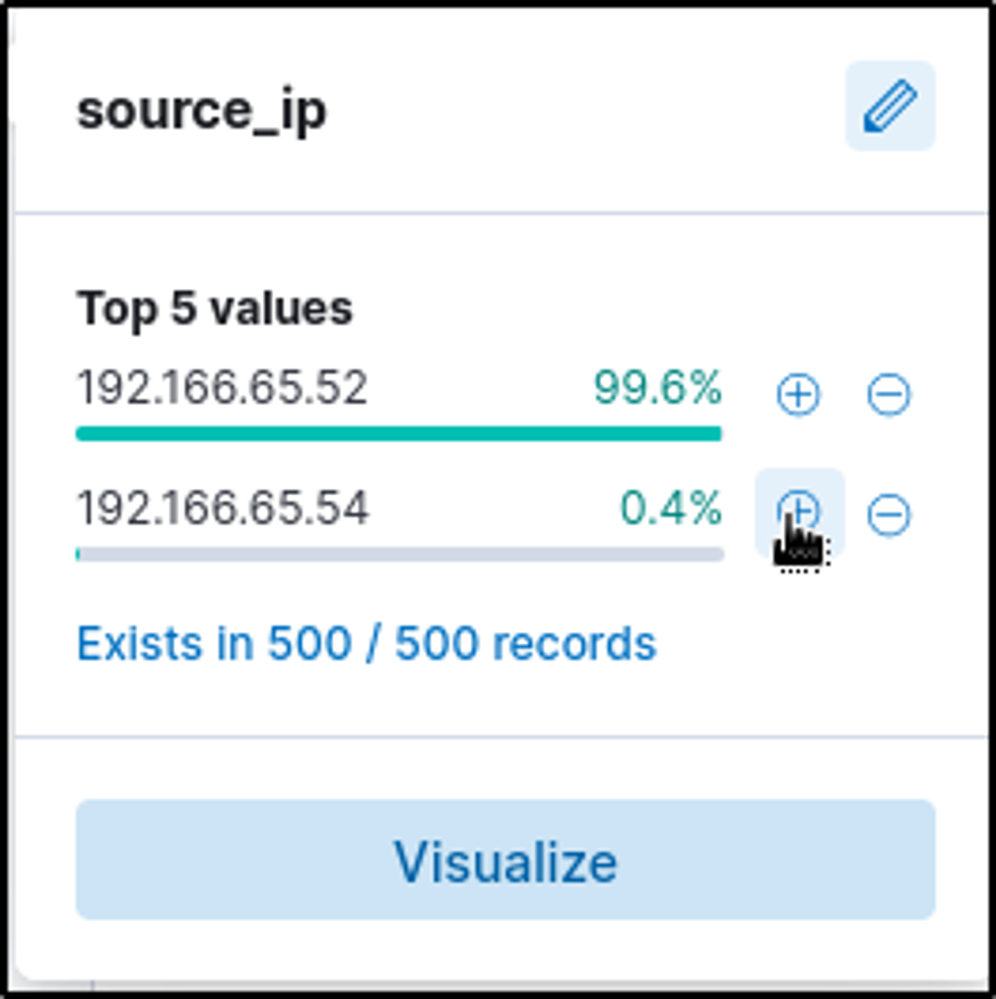
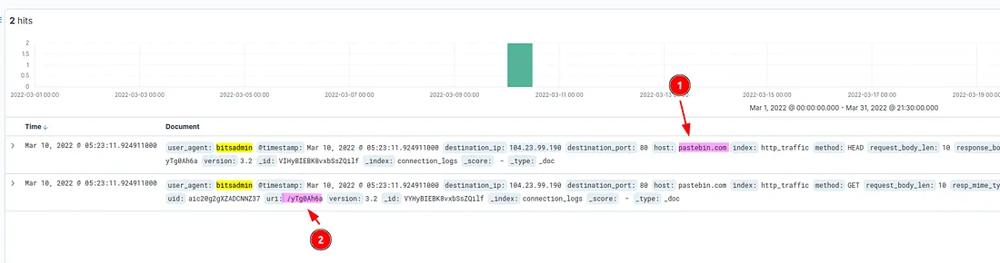
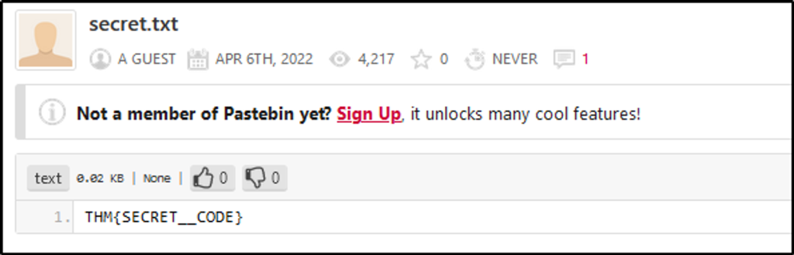

# ItsyBitsy — C2 Communication Detection Write-up
**Platform:** TryHackMe  
**Room:** ItsyBitsy  
**Author:** Jasden Singh  
**Date:** 2025  
**Tags:** `C2 Detection` `ELK Stack` `Elastic` `Kibana` `SIEM` `Network Analysis` `SOC`

---

## Scenario

During routine SOC monitoring, an IDS alert flagged potential Command & Control (C2) communication originating from a machine belonging to user **Browne** in the HR department. A week's worth of HTTP connection logs were ingested into the `connection_logs` index in Kibana for analysis.

**Objective:** Examine the network connection logs, identify the C2 infrastructure, retrieve the accessed file, and determine the full scope of the compromise.

---

## Investigation

### Step 1 — Scoping the Logs

The investigation began by setting the time range in Kibana Discover to **March 1–31, 2022** to scope the full dataset available for analysis.



| Field | Value |
|---|---|
| Index | `connection_logs` |
| Time Range | March 1, 2022 – March 31, 2022 |
| Total Events | **1,482 hits** |

The activity was concentrated in a short burst around **March 6–13**, with the spike visible in the histogram — unusual for normal HR department browsing behaviour. This clustering of activity in a narrow window is consistent with automated C2 beacon traffic rather than organic user activity.

---

### Step 2 — Identifying the Suspected Host

To isolate Browne's machine, the `source_ip` field statistics were examined to identify anomalous IPs in the dataset.



| Source IP | % of Traffic | Assessment |
|---|---|---|
| `192.166.65.52` | 99.6% | Normal — baseline traffic |
| `192.166.65.54` | 0.4% | ⚠️ Anomalous — Browne's machine |

**Key Finding:** `192.166.65.54` accounted for only 0.4% of total traffic but generated the suspicious activity. In SIEM analysis, low-volume outlier IPs are often more significant than high-volume ones — normal machines generate noise, compromised machines generate signals.

A filter was applied for `source_ip: 192.166.65.54` to isolate all activity from Browne's machine.


Filtering to this IP returned exactly **2 hits** — both on **March 10, 2022 at 11:23** — confirming this was a targeted, low-noise C2 connection rather than noisy malware behaviour.

---

### Step 3 — Identifying the C2 Mechanism

Examining the two log entries revealed the method used for C2 communication.



| Field | Value | Significance |
|---|---|---|
| `user_agent` | `bitsadmin` | ⚠️ Windows LOLBin abused for download |
| `host` | `pastebin.com` | C2 filesharing platform |
| `destination_ip` | `104.23.99.190` | Pastebin's hosting IP |
| `destination_port` | `80` | Unencrypted HTTP — no SSL |
| `method` | `HEAD` then `GET` | First checked file exists, then downloaded |
| `uri` | `/yTg0Ah6a` | Specific paste accessed |

**Key Finding — LOLBin Abuse:** The user agent `bitsadmin` is a legitimate Windows binary (Background Intelligent Transfer Service) built into Windows for file downloads. Attackers abuse it specifically because it is a trusted, signed Microsoft binary that bypasses application whitelisting and often goes undetected by endpoint security tools. This technique is documented in **MITRE ATT&CK T1197 — BITS Jobs**.

**Key Finding — Pastebin as C2:** Using a legitimate, trusted filesharing platform like Pastebin as C2 infrastructure is a well-documented evasion technique. Traffic to `pastebin.com` is rarely blocked by firewalls, blending the C2 communication into normal web traffic. The attacker hosted their payload/instructions as a paste and had the malware retrieve it via HTTP.

---

### Step 4 — Retrieving the C2 File

The full C2 URL was constructed from the log entries:

```
pastebin.com/yTg0Ah6a
```

Navigating to this URL revealed the accessed file and its contents.



| Field | Value |
|---|---|
| Filename | `secret.txt` |
| Platform | Pastebin.com |
| Uploaded by | A Guest (anonymous) |
| Upload Date | April 6, 2022 |
| File Size | 0.02 KB |
| Content | `THM{SECRET__CODE}` |

**Key Finding:** The file contained a secret code in the format `THM{SECRET__CODE}` — confirming this was the C2 payload retrieved by the infected machine. The anonymous upload and small file size are consistent with a simple C2 instruction or beacon response file — attackers often use minimal plaintext files on public platforms to pass commands or exfiltrate small data.

---

## Attack Reconstruction

Piecing together the evidence, the full attack chain for this incident was:

```
1. Browne's machine (192.166.65.54) was compromised
         ↓
2. Malware used bitsadmin (legitimate Windows binary) to avoid detection
         ↓
3. Connected to pastebin.com/yTg0Ah6a via HTTP on port 80
         ↓
4. First sent a HEAD request — checked the file existed
         ↓
5. Then sent a GET request — downloaded secret.txt
         ↓
6. Retrieved contents: THM{SECRET__CODE}
```

The use of HTTP (port 80) rather than HTTPS means the traffic was **unencrypted and inspectable** — a good reminder that while HTTPS hides content, HTTP C2 traffic can be fully read in connection logs, which is precisely what enabled this investigation.

---

## IOC Summary

| IOC Type | Value | Verdict |
|---|---|---|
| Infected Host IP | `192.166.65.54` | Compromised — Browne's machine |
| C2 Platform | `pastebin.com` | Abused for C2 hosting |
| C2 Destination IP | `104.23.99.190` | Pastebin hosting infrastructure |
| Full C2 URL | `pastebin.com/yTg0Ah6a` | Malicious paste |
| Filename | `secret.txt` | C2 payload file |
| LOLBin Abused | `bitsadmin.exe` | T1197 — BITS Jobs |
| Activity Timeframe | March 10, 2022, 11:23 | Two connections, 0 seconds apart |

---

## MITRE ATT&CK Mapping

| Technique | ID | Description |
|---|---|---|
| BITS Jobs | T1197 | bitsadmin used to download C2 payload |
| Web Service as C2 | T1102 | Pastebin used as C2 channel |
| Ingress Tool Transfer | T1105 | File downloaded from external server |

---

## Verdict

**Classification:** ✅ CONFIRMED C2 COMMUNICATION  
**Severity:** 🔴 HIGH  
**Affected Host:** `192.166.65.54` (Browne, HR Department)  
**C2 Method:** LOLBin (bitsadmin) + Public filesharing platform (Pastebin)

---

## Recommended Actions

1. **Isolate `192.166.65.54` immediately** — pull the machine from the network to prevent further C2 communication or lateral movement
2. **Block `pastebin.com`** at the web proxy and firewall for corporate endpoints — or implement SSL inspection if blocking is not feasible
3. **Hunt for bitsadmin usage** across all endpoints — query SIEM for any other machines using bitsadmin as a user agent or running `bitsadmin.exe` as a process
4. **Investigate what else Browne's machine connected to** — expand the time range beyond March 2022 to determine when the initial compromise occurred
5. **Check for lateral movement** — review authentication logs for `192.166.65.54` making connections to internal servers or other endpoints
6. **Submit the Pastebin URL** `pastebin.com/yTg0Ah6a` to threat intelligence platforms and request takedown via Pastebin's abuse reporting

---

## Key Takeaways

**1. Low-volume outliers are high-priority signals.**
`192.166.65.54` generated only 0.4% of the total traffic — easy to miss in a noisy dataset. Sorting by least-common source IPs rather than most-common is a valuable hunting technique when looking for low-and-slow C2 activity.

**2. LOLBins are a major detection gap.**
`bitsadmin` is a signed Microsoft binary that has legitimate uses. Endpoint security tools frequently whitelist it. Detecting its abuse requires behavioural analysis — specifically, looking for bitsadmin making outbound connections to public internet destinations rather than internal update servers.

**3. Legitimate platforms make excellent C2 infrastructure.**
Pastebin, GitHub, Google Drive, and similar trusted platforms are regularly abused for C2 because their traffic is almost never blocked by firewalls. Detection requires inspecting the *content* and *destination path* of connections, not just the domain.

**4. HTTP C2 is a double-edged sword for attackers.**
Using HTTP instead of HTTPS meant the traffic was unencrypted and fully readable in connection logs — which is exactly what enabled this investigation. Analysts should always check for C2 traffic on port 80, as some attackers sacrifice encryption for simplicity.

**5. The HEAD + GET pattern is a C2 fingerprint.**
The sequence of a HEAD request followed immediately by a GET request to the same resource is a common pattern in malware that checks whether a file exists before downloading it. This two-step pattern in logs is a useful detection rule to build in a SIEM.

---

*Write-up by Jasden Singh | [LinkedIn](https://www.linkedin.com/in/jasden-singh-8425b3268/) | [GitHub] (https://github.com/jasden)*
