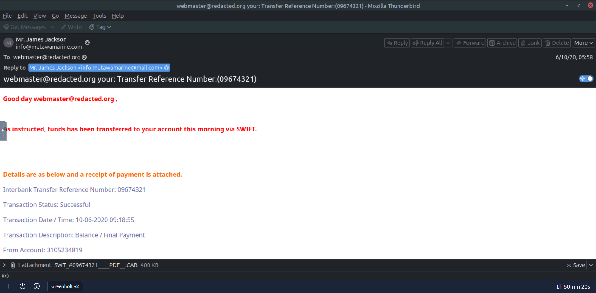
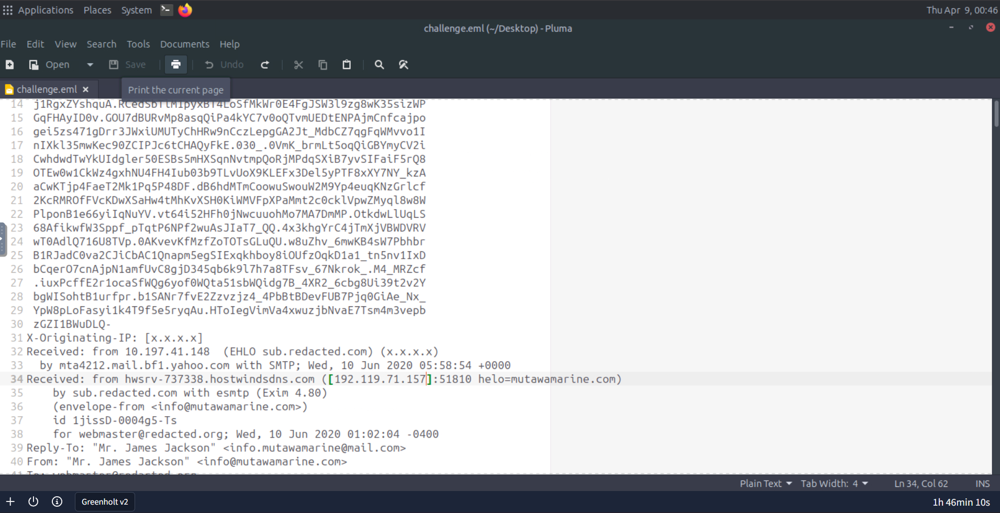
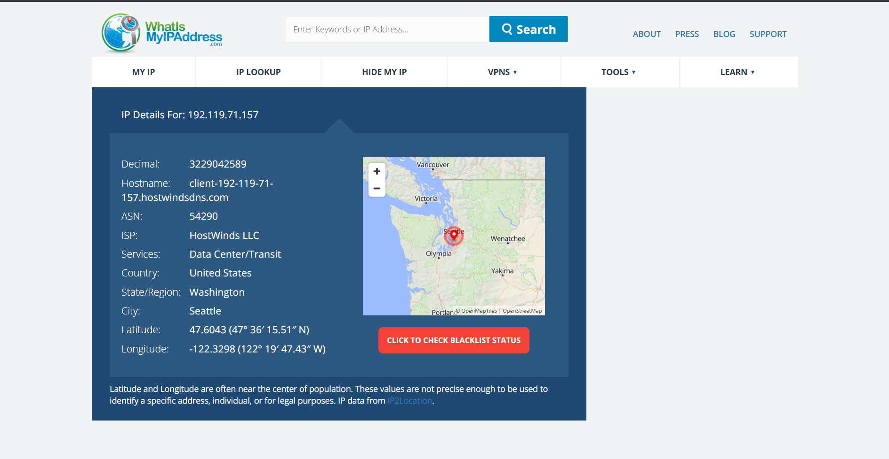
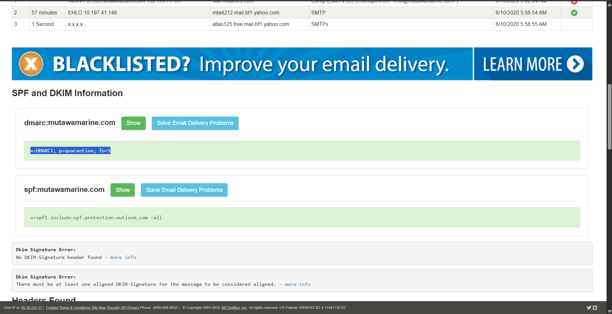
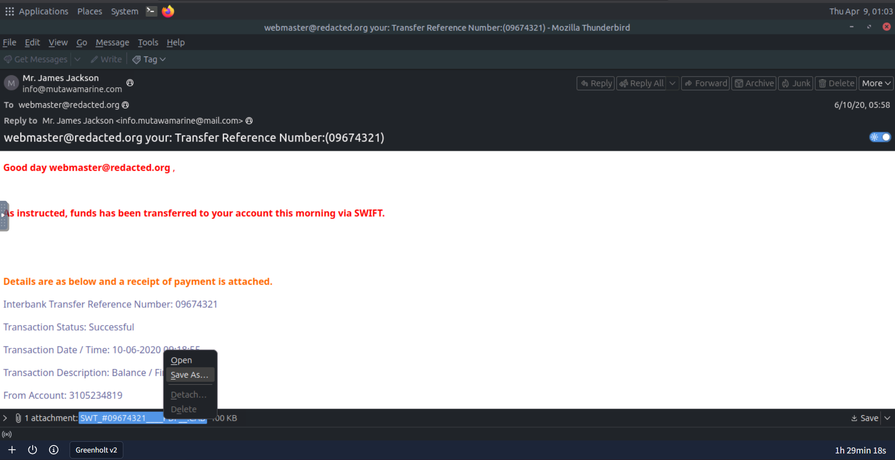
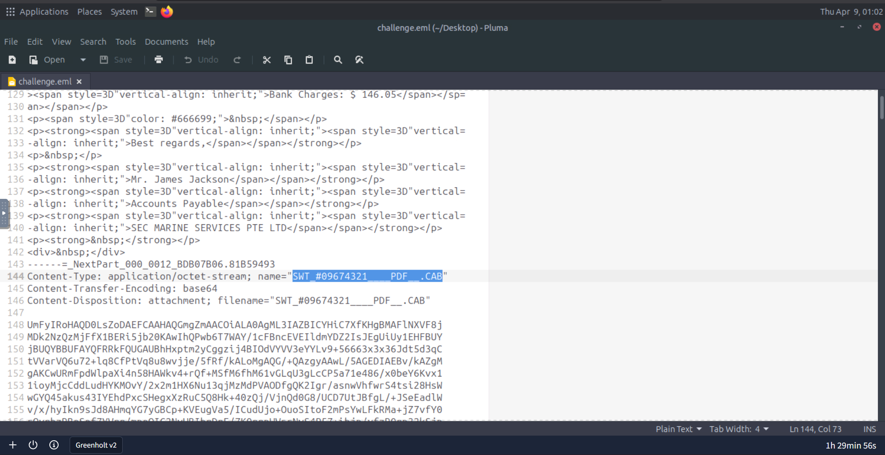
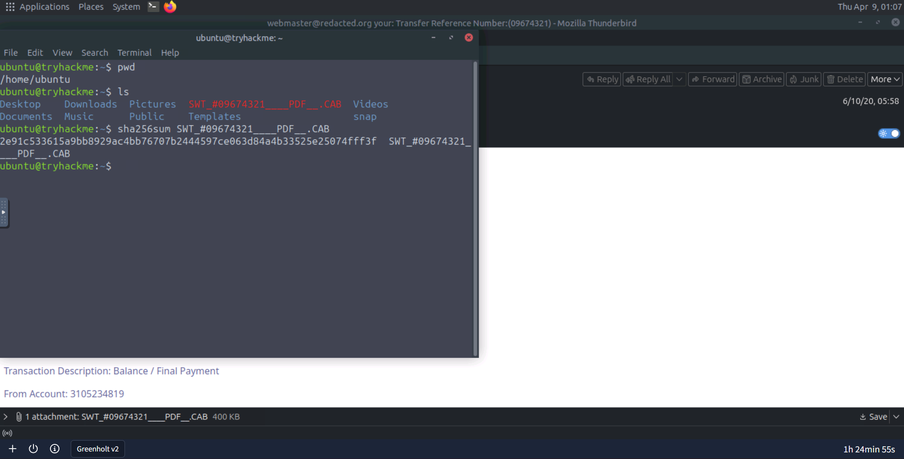
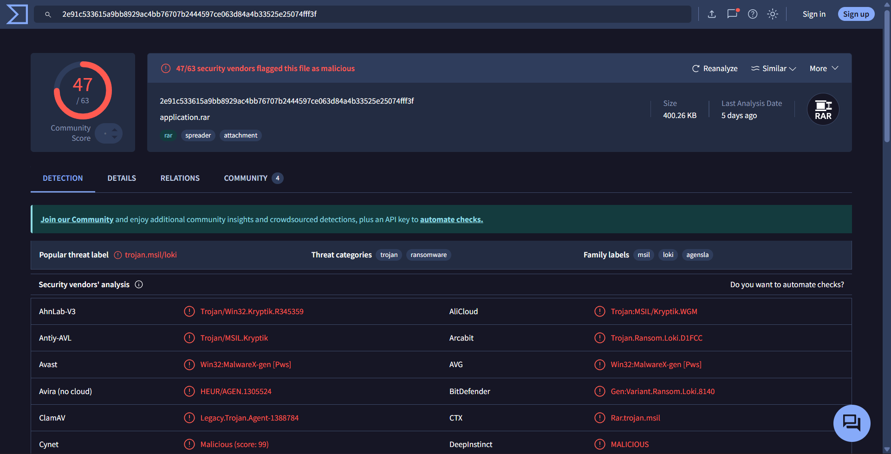

# The Greenholt Phish — SOC Investigation Write-up
**Platform:** TryHackMe  
**Room:** The Greenholt Phish  
**Author:** Jasden Singh  
**Date:** April 2026  
**Tags:** `Phishing` `Email Header Analysis` `IOC Investigation` `VirusTotal` `Malware` `SOC`

---

## Scenario

A sales executive at Greenholt PLC received a suspicious email from a known customer. The message raised several red flags — a generic greeting, an unexpected reference to a money transfer, and an unsolicited attachment. The employee noted the communication style did not match the customer's usual behaviour and escalated it to the SOC for analysis.

**Objective:** Determine whether the email is legitimate or a phishing attempt, extract all IOCs, and produce a triage report.

---

## Investigation

### Step 1 — Email Overview

The email was opened in Mozilla Thunderbird for initial inspection.



At first glance, several elements stood out immediately:

- The greeting was generic — **"Good day webmaster@redacted.org"** — addressing the recipient by their email address rather than their name, which is unusual for a known business contact
- The email claimed funds had already been transferred via SWIFT and provided transaction details
- The body was written entirely in **red text**, an unusual stylistic choice that does not match typical corporate communication
- A file attachment was present named **SWT_#09674321____PDF__.CAB** — the filename was crafted to appear like a PDF receipt but the extension was `.CAB`, not `.PDF`

| Field | Value |
|---|---|
| Subject | `your: Transfer Reference Number:(09674321)` |
| Transfer Reference Number | `09674321` |
| Display Name | `Mr. James Jackson` |
| Sent To | `webmaster@redacted.org` |
| Date | `10 June 2020, 05:58` |

---

### Step 2 — Email Header Analysis

The raw `.eml` file was opened in Pluma text editor to inspect the full email headers.



This is where the first major red flag appeared. Cross-referencing the key header fields:

| Header Field | Value | Assessment |
|---|---|---|
| From (Display Name) | `Mr. James Jackson` | — |
| From (Actual Address) | `info@mutawamarine.com` | Claimed sender domain |
| Reply-To | `info.mutawamarine@mail.com` | ⚠️ Different domain — `mail.com` not `mutawamarine.com` |
| Originating IP | `192.119.71.157` | To be investigated |
| Received via | `mta4212.mail.bf1.yahoo.com` | Email routed through Yahoo Mail servers |

**Key Finding — Reply-To Mismatch:** The `From` address used `mutawamarine.com` but the `Reply-To` was set to `info.mutawamarine@mail.com` — a completely different domain (`mail.com` is a free public email provider). This is a deliberate social engineering technique: the email appears to come from the legitimate business, but any reply would go to an attacker-controlled inbox. This is a textbook **Reply-To hijacking** technique.

---

### Step 3 — Originating IP Investigation

The originating IP address `192.119.71.157` was investigated using WhatIsMyIPAddress.



| Field | Value |
|---|---|
| IP Address | `192.119.71.157` |
| Hostname | `client-192-119-71-157.hostwindsdns.com` |
| ISP / Owner | **HostWinds LLC** |
| Service Type | Data Center / Transit |
| Location | Seattle, Washington, United States |

**Finding:** The email originated from a **commercial data centre IP** owned by HostWinds LLC — a web hosting and VPS provider. A legitimate business email from a marine company would typically originate from their own mail server or a recognised corporate email provider. Originating from a hosting provider's data centre IP is a strong indicator that the sender was using a rented server or VPS to send this email, not a legitimate corporate mail infrastructure.

---

### Step 4 — SPF & DMARC Record Verification

SPF and DMARC records for the sender domain `mutawamarine.com` were checked using MXToolbox.



| Record | Value | Assessment |
|---|---|---|
| SPF | `v=spf1 include:spf.protection.outlook.com -all` | Domain uses Microsoft 365 for mail — but this email was routed through Yahoo, not Microsoft |
| DMARC | `v=DMARC1; p=quarantine; fo=1` | Policy set to quarantine suspicious mail |
| DKIM | ❌ No DKIM signature found | Missing entirely |

**Finding:** The SPF record indicates `mutawamarine.com` should only send mail through Microsoft 365 (`spf.protection.outlook.com`). However, this email was received via Yahoo Mail servers — a direct SPF alignment failure. The absence of a DKIM signature means there is no cryptographic proof the email came from the claimed domain. Combined with the DMARC `quarantine` policy, this email should have been automatically flagged or quarantined by the recipient's mail gateway.

---

### Step 5 — Attachment Analysis

The attachment was identified in both the email client and the raw `.eml` source.





| Field | Value |
|---|---|
| Displayed Filename | `SWT_#09674321____PDF__.CAB` |
| Claimed Type (by name) | PDF receipt |
| Actual Extension | `.CAB` (Cabinet archive) |

The filename is deliberately misleading — the string `____PDF____` is embedded in the middle of the filename to trick a casual reader into thinking it is a PDF file. The actual file type is a `.CAB` archive, which is a Windows Cabinet file capable of containing executable content.

The attachment was saved to the virtual environment for hash analysis.


---

### Step 6 — File Hash Analysis

The SHA256 hash of the attachment was calculated using the `sha256sum` command in the terminal.



```
sha256sum SWT_#09674321____PDF__.CAB
2e91c533615a9bb8929ac4bb76707b2444597ce063d84a4b33525e25074fff3f
```

The hash was submitted to VirusTotal for reputation analysis.



| Field | Value |
|---|---|
| SHA256 | `2e91c533615a9bb8929ac4bb76707b2444597ce063d84a4b33525e25074fff3f` |
| File Size | `400.26 KB` |
| Actual File Type | **RAR archive** (not a CAB file — double disguise) |
| VirusTotal Detections | **47 / 63 vendors flagged as malicious** |
| Popular Threat Label | `trojan.msil/loki` |
| Threat Categories | Trojan, Ransomware |
| Family Labels | `msil`, `loki`, `agensla` |

**Finding:** The attachment is flagged by 47 out of 63 security vendors. The file is identified as a **RAR archive** — not a CAB file as the extension implies, and certainly not a PDF as the filename suggests. The file contains **Loki Bot** malware, a well-documented information-stealing trojan capable of harvesting credentials, browser data, and cryptocurrency wallets. Multiple vendors also classify it under ransomware behaviour families.

This is a **triple-layer deception**: the filename suggests PDF, the extension says CAB, but the actual file is a RAR archive containing a trojan.

---

## IOC Summary

| IOC Type | Value | Verdict |
|---|---|---|
| Sender Address | `info@mutawamarine.com` | Spoofed / suspicious |
| Reply-To Address | `info.mutawamarine@mail.com` | Attacker-controlled inbox |
| Originating IP | `192.119.71.157` | Malicious — hosted on data centre VPS |
| IP Owner | HostWinds LLC (ASN 54290) | Hosting provider, not corporate mail |
| Attachment Filename | `SWT_#09674321____PDF__.CAB` | Malicious — deliberately misleading |
| SHA256 Hash | `2e91c533615a9bb8929ac4bb76707b2444597ce063d84a4b33525e25074fff3f` | **Malicious — 47/63 detections** |
| Malware Family | Loki Bot / trojan.msil/loki | Credential-stealing trojan |

---

## Verdict

**Classification:** ✅ MALICIOUS — Phishing email with malware attachment  
**Severity:** 🔴 HIGH  
**Malware Type:** Loki Bot — credential stealer / infostealer trojan

---

## Recommended Actions

1. **Quarantine the email** from all mailboxes that received it immediately
2. **Block the sender domain** `mutawamarine.com` and Reply-To domain `mail.com` at the email gateway (note: `mail.com` is a public provider — use sender-specific rules)
3. **Block the originating IP** `192.119.71.157` at the perimeter firewall
4. **Block the file hash** `2e91c533615a9bb8929ac4bb76707b2444597ce063d84a4b33525e25074fff3f` in endpoint security tools
5. **Check if the attachment was opened** — if any user executed the file, assume credential compromise. Force immediate password resets and enable MFA
6. **Hunt for lateral movement** — Loki Bot exfiltrates credentials. Check authentication logs for unusual logins following the email receipt date (10 June 2020)
7. **Update email gateway rules** to flag `.CAB` attachments and filenames containing misleading type strings like `____PDF____`

---

## Key Takeaways

**1. The Reply-To field is a critical analysis point.**
Most users only look at the display name or From address. Attackers exploit this by keeping the From address looking legitimate while routing all replies to an attacker-controlled inbox — ready to continue the social engineering conversation.

**2. Originating IP tells a story.**
A marine company's email originating from a Seattle data centre VPS is an immediate anomaly. Checking the IP against the expected sending infrastructure (the SPF record said Microsoft 365) confirmed the email bypassed the legitimate mail system entirely.

**3. Filenames are not reliable indicators of file type.**
The triple-layer disguise here — PDF in the name, .CAB extension, actually a RAR — is a common technique to bypass both human inspection and some automated filters. Always hash the file and check its true file type.

**4. Loki Bot is an active, well-documented threat.**
Loki Bot has been in active circulation since 2015 and specifically targets saved credentials in browsers, FTP clients, and email clients. An organisation in finance or shipping (the context here) is a high-value target for this type of infostealer.

**5. Missing DKIM + SPF mismatch = email gateway failure.**
This email should never have reached the inbox. Proper email gateway configuration enforcing DMARC policy would have quarantined it automatically. Detection at the analyst level is the last line of defence — the earlier controls failed.

---

*Write-up by Jasden Singh | [LinkedIn](https://linkedin.com/in/jasdensingh) | [GitHub](https://github.com/jasdensingh)*
